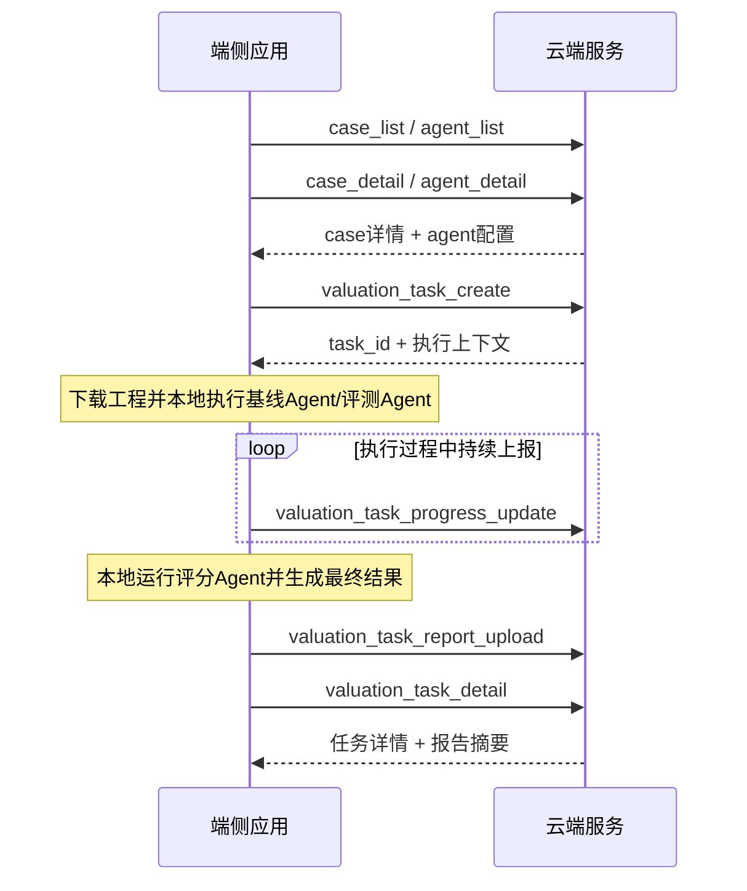

# Cloud API

本文档定义端云协同模式下的云测接口。

## 0. 设计理由与优劣势

本方案采用“云端存储与展示，端侧执行”的端云协同设计。

设计理由：

- 被测对象是完整 agent 产品，内部能力闭环应保持在 agent 内部，不适合为了云测而拆散。
- agent 的真实效果强依赖端侧开发环境，例如本地工程目录、代理、SDK、编译链路和工具配置。
- HarmonyOS 工程相关能力在端侧更容易保持真实运行环境，云端统一复刻成本高。
- 云端更适合承担统一管理能力，例如 case 管理、agent 配置管理、任务记录、进度存储和报告展示。
- 端侧已有执行链路，采用端侧执行可以直接复用现有实现，减少重复建设。

优势：

- 更接近真实使用场景，评测结果更可信。
- 不破坏被测 agent 的原始能力边界。
- 云端实现更简单，主要负责存储、管理和展示。
- 端侧可以复用已有执行环境，接入成本更低。

劣势：

- 端侧环境一致性较弱，不同机器之间可能存在差异。
- 任务执行稳定性依赖端侧本地环境。
- 云端无法完全掌控执行过程，需要依赖端侧主动上报。
- 端侧需要自行管理工程下载、缓存、执行和上报流程。

## 0.1 端云系统交互图



## 1. 系统边界

- 云端负责：
  - case 管理
  - agent 管理
  - valuation task 存储
  - progress 存储
  - report 和打分结果展示
- 端侧负责：
  - 查询 case 详情并下载工程
  - 查询 agent 配置
  - 创建 valuation task
  - 本地执行被测 agent
  - 本地运行评分 agent
  - 上报 progress 和最终 report
- 云端不直接运行被测 agent
- 云端不主动向端侧下发任务

---

## 2. 核心对象

### 2.1 Case

云端管理 case 元数据和工程下载地址。

最小字段：

```json
{
  "case_id": "bug_fix_001",
  "title": "商品列表与详情编辑工程缺陷修复",
  "scenario": "bug_fix",
  "original_project_url": "https://example.com/cases/bug_fix_001/original_project.zip",
  "prompt": "这是一个商品管理工程修复 case，请直接修改代码完成修复。",
  "constraints": [
    "保持现有业务流程不变",
    "优先最小必要修改"
  ]
}
```

其中：

- `constraints` 为可选字段

### 2.2 Agent

agent 是一级对象。

最小字段：

```json
{
  "agent_id": "agent_default",
  "name": "Default",
  "adapter": "opencode",
  "model": "minimax-cn-coding-plan/MiniMax-M2.7",
  "version": "v1"
}
```

当前先固定关键参数：

- `agent_id`
- `name`
- `adapter`
- `model`
- `version`

### 2.3 Valuation Task

valuation task 是一次实际评测运行记录。

任务对外统一使用：

- `agent_baseline`
- `agent_candidate`
- `baseline`
- `candidate`

任务创建时传入：

- `agent_baseline_id`
- `agent_candidate_id`

云端落库时必须额外固化：

- `agent_baseline_config`
- `agent_candidate_config`

这样历史任务可复现，不受后续 agent 配置变更影响。

---

## 3. 业务流

1. 端侧调用 `case_list`
2. 端侧调用 `case_detail`
3. 端侧根据 `original_project_url` 下载工程
4. 端侧调用 `agent_list`
5. 端侧调用 `agent_detail`
6. 端侧调用 `valuation_task_create`
7. 端侧本地执行
8. 执行过程中持续调用 `valuation_task_progress_update`
9. 端侧本地运行评分 agent
10. 端侧调用 `valuation_task_report_upload`
11. 前端页面调用 `valuation_task_detail` 查看任务详情和报告摘要

---

## 4. 接口清单

说明：

- 本章节中的请求体和响应体均为最小化示例，主要用于说明当前业务对象之间的关系和核心字段含义。
- 示例中省略了平台通用字段，例如 `created_at`、`updated_at`、`created_by`、`updated_by`、`operator`、`request_id`、`trace_id`、统一 `code/message` 包装等。
- 最终接口落地时，应在本章节定义的核心业务字段基础上，补齐统一的管理字段、审计字段和异常响应规范。
- 当前文档重点不在完整接口包装，而在明确 case、agent、valuation task、progress、report 之间的数据关系。

## 4.1 Case 接口

### `case_create`

建议路径：

- `POST /v1/case/create`

作用：

- 创建 case
- 后续可扩展为 case 导入入口

最小请求：

```json
{
  "case_id": "bug_fix_001",
  "title": "商品列表与详情编辑工程缺陷修复",
  "scenario": "bug_fix",
  "original_project_url": "https://example.com/cases/bug_fix_001/original_project.zip",
  "prompt": "这是一个商品管理工程修复 case，请直接修改代码完成修复。",
  "constraints": [
    "保持现有业务流程不变",
    "优先最小必要修改"
  ]
}
```

最小返回：

```json
{
  "case_id": "bug_fix_001",
  "created": true
}
```

---

### `case_list`

建议路径：

- `GET /v1/case/list`

作用：

- 查询 case 列表

最小返回：

```json
[
  {
    "case_id": "bug_fix_001",
    "title": "商品列表与详情编辑工程缺陷修复",
    "scenario": "bug_fix"
  }
]
```

---

### `case_detail`

建议路径：

- `GET /v1/case/detail?case_id=bug_fix_001`

作用：

- 查询单个 case 详情

最小返回：

```json
{
  "case_id": "bug_fix_001",
  "title": "商品列表与详情编辑工程缺陷修复",
  "scenario": "bug_fix",
  "original_project_url": "https://example.com/cases/bug_fix_001/original_project.zip",
  "prompt": "这是一个商品管理工程修复 case，请直接修改代码完成修复。",
  "constraints": [
    "保持现有业务流程不变",
    "优先最小必要修改"
  ]
}
```

---

## 4.2 Agent 接口

### `agent_create`

建议路径：

- `POST /v1/agent/create`

作用：

- 创建 agent 配置

最小请求：

```json
{
  "agent_id": "agent_default",
  "name": "Default",
  "adapter": "opencode",
  "model": "minimax-cn-coding-plan/MiniMax-M2.7",
  "version": "v1"
}
```

最小返回：

```json
{
  "agent_id": "agent_default",
  "created": true
}
```

---

### `agent_list`

建议路径：

- `GET /v1/agent/list`

作用：

- 查询 agent 列表

最小返回：

```json
[
  {
    "agent_id": "agent_default",
    "name": "Default",
    "adapter": "opencode",
    "model": "minimax-cn-coding-plan/MiniMax-M2.7",
    "version": "v1"
  },
  {
    "agent_id": "codex_local",
    "name": "Codex Local",
    "adapter": "codex_local",
    "model": "gpt-5.4",
    "version": "v1"
  }
]
```

---

### `agent_detail`

建议路径：

- `GET /v1/agent/detail?agent_id=agent_default`

作用：

- 查询单个 agent 详情

最小返回：

```json
{
  "agent_id": "agent_default",
  "name": "Default",
  "adapter": "opencode",
  "model": "minimax-cn-coding-plan/MiniMax-M2.7",
  "version": "v1"
}
```

---

## 4.3 Valuation Task 接口

### `valuation_task_create`

建议路径：

- `POST /v1/valuationTask/create`

作用：

- 端侧创建一个评测任务
- 云端返回 `task_id`
- 创建成功后端侧执行，后续通过 `task_id` 上报 progress 和 report
- 返回端侧立刻执行所需的最小上下文

`run_target` 取值说明：

- `both`：同时执行基线Agent和评测Agent
- `baseline`：仅执行基线Agent
- `candidate`：仅执行评测Agent

最小请求：

```json
{
  "run_target": "both",
  "case_ids": ["bug_fix_001"],
  "agent_baseline_id": "agent_default",
  "agent_candidate_id": "codex_local"
}
```

最小返回：

```json
{
  "task_id": "task_20260402_001",
  "status": "created",
  "agent_baseline_config": {
    "agent_id": "agent_default",
    "name": "Default",
    "adapter": "opencode",
    "model": "minimax-cn-coding-plan/MiniMax-M2.7",
    "version": "v1"
  },
  "agent_candidate_config": {
    "agent_id": "codex_local",
    "name": "Codex Local",
    "adapter": "codex_local",
    "model": "gpt-5.4",
    "version": "v1"
  },
  "cases": [
    {
      "case_id": "bug_fix_001",
      "title": "商品列表与详情编辑工程缺陷修复",
      "scenario": "bug_fix",
      "original_project_url": "https://example.com/cases/bug_fix_001/original_project.zip",
      "prompt": "这是一个商品管理工程修复 case，请直接修改代码完成修复。",
      "constraints": [
        "保持现有业务流程不变",
        "优先最小必要修改"
      ]
    }
  ]
}
```

---

### `valuation_task_detail`

建议路径：

- `GET /v1/valuationTask/detail?task_id=task_20260402_001`

作用：

- 页面查询任务详情
- 返回更完整的任务详情、进度摘要和报告摘要

最小返回：

```json
{
  "task_id": "task_20260402_001",
  "status": "running",
  "run_target": "both",
  "case_ids": ["bug_fix_001"],
  "created_at": "2026-04-02T10:00:00+08:00",
  "updated_at": "2026-04-02T10:05:00+08:00",
  "agent_baseline_config": {
    "agent_id": "agent_default",
    "name": "Default",
    "adapter": "opencode",
    "model": "minimax-cn-coding-plan/MiniMax-M2.7",
    "version": "v1"
  },
  "agent_candidate_config": {
    "agent_id": "codex_local",
    "name": "Codex Local",
    "adapter": "codex_local",
    "model": "gpt-5.4",
    "version": "v1"
  },
  "total_cases": 1,
  "finished_cases": 0,
  "progress_summary": {
    "current_case_id": "bug_fix_001"
  },
  "cases": [
    {
      "case_id": "bug_fix_001",
      "title": "商品列表与详情编辑工程缺陷修复",
      "scenario": "bug_fix"
    }
  ],
  "report_summary": null
}
```

---

### `valuation_task_progress_update`

建议路径：

- `POST /v1/valuationTask/progress/update`

作用：

- 端侧持续上报进度

说明：

- 云端不会自己生成进度
- progress 只记录过程态，不记录最终评分结论
- `task_status` 用来表示任务当前状态
- 当前建议值：
  - `pending`：未运行
  - `running`：运行中
  - `completed`：已完成
- `case_progresses[].status` 用来表示单个 case 当前所处阶段
- 当前建议值：
  - `preparing`：准备中
  - `baseline_running`：基线Agent运行中
  - `baseline_compile_checking`：基线Agent结果编译确认
  - `candidate_running`：评测Agent运行中
  - `candidate_compile_checking`：评测Agent结果编译确认
  - `llm_scoring`：LLM评分中
  - `completed`：完成
  - `failed`：失败
- `case_progresses` 建议只上报本次发生变化的 case，云端按 `case_id` 覆盖更新
- `times` 用来记录各阶段耗时信息，已完成阶段必须带 `elapsed_ms`

最小请求：

```json
{
  "task_id": "task_20260402_001",
  "task_status": "running",
  "total_cases": 1,
  "finished_cases": 0,
  "success_cases": 0,
  "failed_cases": 0,
  "case_progresses": [
    {
      "case_id": "bug_fix_001",
      "title": "商品列表与详情编辑工程缺陷修复",
      "scenario": "bug_fix",
      "status": "candidate_compile_checking",
      "times": {
        "preparing": {
          "elapsed_ms": 5000
        },
        "baseline_running": {
          "elapsed_ms": 145000
        },
        "baseline_compile_checking": {
          "elapsed_ms": 10000
        },
        "candidate_running": {
          "elapsed_ms": 130000
        },
        "candidate_compile_checking": {
          "elapsed_ms": null
        }
      },
      "error": null
    }
  ]
}
```

最小返回：

```json
{
  "accepted": true
}
```

后端更新规则：

- 顶层任务进度字段按最新请求覆盖：
  - `task_status`
  - `total_cases`
  - `finished_cases`
  - `success_cases`
  - `failed_cases`
- `finished_cases = success_cases + failed_cases`
- `case_progresses` 按 `case_id` 做 upsert：
  - 已存在则覆盖该 case 当前状态
  - 不存在则新增该 case 记录
- `times` 按阶段键覆盖更新：
  - 同一阶段的新值覆盖旧值
  - 未出现在本次请求中的阶段保持原值
- `completed` 和 `failed` 为 case 最终状态：
  - `completed` 计入 `success_cases`
  - `failed` 计入 `failed_cases`

---

### `valuation_task_report_upload`

建议路径：

- `POST /v1/valuationTask/report/upload`

作用：

- 端侧上传最终结果
- 上传按评分项整理后的最终结果

说明：

- 当前评分项固定为：
  - `code_quality`：代码质量，主要看静态代码相关结果，例如格式、语法、圈复杂度等
  - `execution_metrics`：agent 执行的客观数据，例如耗时、token、cost、编译修复次数、是否可编译
  - `case_constraints`：case 自身约束项的满足情况
  - `manual_review`：人工复检结果，端侧当前阶段暂不上报
- 原始事实和评分结果一起作为 report 的一部分保留
- 评分 agent 基于这些事实完成打分
- 云端只存最终结果，不参与评分过程

最小请求：

```json
{
  "task_id": "task_20260402_001",
  "summary": {
    "total_cases": 1,
    "baseline_avg": 82,
    "candidate_avg": 89,
    "gain": 7,
    "score_item_avgs": {
      "code_quality": {
        "baseline": 84,
        "candidate": 88
      },
      "execution_metrics": {
        "baseline": 80,
        "candidate": 92
      },
      "case_constraints": {
        "baseline": 82,
        "candidate": 87
      },
      "manual_review": null
    }
  },
  "cases": [
    {
      "case_id": "bug_fix_001",
      "baseline_total": 82,
      "candidate_total": 89,
      "gain": 7,
      "score_reason": "评测Agent在执行效率、约束满足度和静态代码质量上均优于基线Agent。",
      "score_items": {
        "code_quality": {
          "baseline": 85,
          "candidate": 88,
          "reason": "两侧代码均可编译，评测Agent静态质量更稳定，复杂度控制更好。"
        },
        "execution_metrics": {
          "baseline": 78,
          "candidate": 93,
          "reason": "评测Agent耗时更短，token 更少，且编译修复次数更少。"
        },
        "case_constraints": {
          "baseline": 83,
          "candidate": 86,
          "reason": "两侧均满足 case 约束，评测Agent在最小必要修改方面表现更好。"
        },
        "manual_review": {
          "status": "not_uploaded"
        }
      },
      "detail_items": {
        "code_quality": {
          "baseline": {
            "syntax_passed": true,
            "compile_passed": true,
            "cyclomatic_complexity": 12
          },
          "candidate": {
            "syntax_passed": true,
            "compile_passed": true,
            "cyclomatic_complexity": 9
          }
        },
        "execution_metrics": {
          "baseline": {
            "duration_ms": 398055,
            "compilable": true,
            "compile_fix_count": 2,
            "input_tokens": 12000,
            "output_tokens": 3000,
            "total_tokens": 15000,
            "cost": 0.52
          },
          "candidate": {
            "duration_ms": 286000,
            "compilable": true,
            "compile_fix_count": 1,
            "input_tokens": 9800,
            "output_tokens": 2600,
            "total_tokens": 12400,
            "cost": 0.41
          }
        },
        "case_constraints": {
          "baseline": [
            {
              "constraint": "保持现有业务流程不变",
              "passed": true
            }
          ],
          "candidate": [
            {
              "constraint": "保持现有业务流程不变",
              "passed": true
            }
          ]
        }
      }
    }
  ],
  "comparison_labels": {
    "baseline": "基线Agent",
    "candidate": "评测Agent"
  }
}
```

最小返回：

```json
{
  "accepted": true
}
```

---

## 5. 第一版先不做的事情

第一版先明确不做：

- 云端主动向端侧推任务
- 长连接 / WebSocket
- 云端直接运行被测 agent
- 云端参与评分过程
- 云端分步调度 agent 内部执行

第一版只做：

- 云端存储
- 端侧执行
- 端侧主动上报
- 端侧评分 agent 产出最终 report
