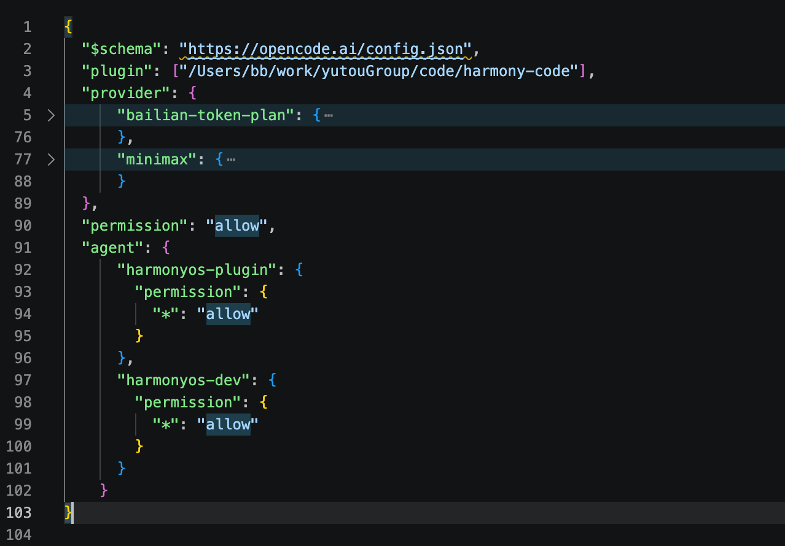

# 本地使用指南

本文只说明本地怎么把执行器跑起来，以及怎么确认它能接任务。

代码执行器总体架构图：


## 1. 前置条件
在管理台配置本地agent地址：


云测下发任务原则：
如果设置了本地调试地址，任务下发走本地
清空本地调试地址，任务下发走远程

本地需要准备：

- Python 3.10+
- Python 包依赖
- Git
- `opencode` 命令
- 可用的 OpenCode 配置文件
- HarmonyOS / DevEco 命令行工具链

检查：

```bash
python --version
git --version
opencode --version
```

如果本机只有 `python3`，后续命令里的 `python` 换成 `python3`。

安装 Python 包：

```bash
python -m pip install fastapi uvicorn "pydantic>=2" PyYAML
```

这些包来自代码里的直接依赖：

- `fastapi`：Executor HTTP 服务。
- `uvicorn`：启动 FastAPI。
- `pydantic>=2`：云测接口模型使用 `field_validator`。
- `PyYAML`：读取 `config/config.yaml` 和 `config/agents.yaml`。

如果缺少 `opencode`，先按 OpenCode 官方方式安装。

## 2. 配置

本地部署主要看两个配置文件：

```text
config/config.yaml
config/agents.yaml
```

### 2.1 `config/config.yaml`

本地一般不需要修改，重点确认云测平台地址、并发数、OpenCode 配置文件路径和 HarmonyOS 工具链路径。

```yaml
harmony_toolchain:
  auto_detect: true
  macos:
    node: "/Applications/DevEco-Studio.app/Contents/tools/node/bin/node"
    hvigor: "/Applications/DevEco-Studio.app/Contents/tools/hvigor/bin/hvigorw.js"
    harmonyos_sdk: "/Applications/DevEco-Studio.app/Contents/sdk"
    java_home: "/Applications/DevEco-Studio.app/Contents/jbr/Contents/Home"

task_manager:
  max_concurrency: 3
  cloud_base_url: "http://<云测平台地址>:3000"

opencode:
  opencode_server_url: "http://127.0.0.1:4096"
  opencode_config_path:
    macos: "~/.opencode/opencode.json"
    linux: "/root/.config/opencode/opencode.json"
    windows: "%APPDATA%\\opencode\\opencode.json"
```

说明：

- `cloud_base_url` 是执行器上报进度和结果的云测平台地址。
- `max_concurrency` 是本地并发任务数。
- `opencode_server_url` 默认使用本机 `4096`。
- `opencode_config_path` 是本机 OpenCode 配置文件位置。
- `harmony_toolchain` 是编译验证使用的 HarmonyOS / DevEco 工具链路径。

`harmony_toolchain` 需要能提供下面 4 个路径：

- `node`
- `hvigorw.js`
- `harmonyos_sdk`
- `java_home`

配置无效时，如果 `auto_detect=true`，程序会尝试自动探测；仍失败则拒绝启动。

如果使用会直接调用命令行工具的 Agent，还需要确认相关命令在当前环境可用，例如：

```bash
ohpm --version
hvigorw --version
```

### 2.2 `config/agents.yaml`

这个文件需要按本地模型配置调整。云测下发任务时，请求路径里会带 `agentId`：


```text
POST /api/cloud-api/agent/{agentId}
```

执行器收到任务后，会用这个 `agentId` 去 `config/agents.yaml` 里查找同名配置。找不到时任务会直接返回 400：

```text
未找到 agent 配置: <agentId>
```

当前示例配置里常见的 agentId：

```text
baseline
baseline-minimax
harmonyos-plugin
harmonyos-plugin-minimax
```

每个 agent 配置主要包含：

- `id`：云测下发时使用的 `agentId`，一般不改。
- `opencode_agent`：OpenCode 内部实际使用的 agent 名称，一般不改。
- `model`：模型 provider/model，需要改成本地 OpenCode 配置里可用的模型 ID。
- `mounted_skills`：任务执行前挂载到 workspace 的 skills，一般不改。
- `extra_prompt`：追加给 Agent 的执行要求，一般不改。

例如云测请求：

```text
POST /api/cloud-api/agent/harmonyos-plugin
```

会匹配：

```yaml
- id: "harmonyos-plugin"
  opencode_agent: "harmonyos-plugin"
```

### 2.3 本地 OpenCode 配置

任务下发前，必须提前配置好本机 OpenCode。这个配置由 `config/config.yaml` 里的 `opencode_config_path` 指定。

执行器只会读取并隔离复制本地已有配置，不会自动生成 provider、plugin、permission 或 agent 配置。

`opencode_config_path` 指向的文件至少要保证：

- provider/model 可用
- 本地插件路径可用
- 任务需要的 OpenCode agent 已配置
- 工具权限允许执行，例如 `permission: allow` 或等价配置

执行器启动 OpenCode 前，会把这份配置复制到隔离目录 `.opencode_runtime/`，避免污染用户全局配置。

opencode.json 文件配置参考：



如果 OpenCode 配置不完整，常见现象是：

- 服务能启动，但 Agent 没有有效工具行为
- 找不到 `harmonyos-plugin` 等 OpenCode agent
- 工具调用被权限拦截
- session 创建成功但任务长时间不推进

## 3. 启动

macOS / Linux：

```bash
./deploy.sh start

关闭
./deploy.sh stop
```

Windows：

```bat
deploy.bat start

关闭
deploy.bat stop
```

脚本会启动 Executor。OpenCode Server 由执行器自动检查和拉起，默认端口：

- Executor：`8000`
- OpenCode：`4096`

常用命令：

```bash
./deploy.sh status
./deploy.sh logs
./deploy.sh stop
./deploy.sh restart-executor
```

Windows 使用对应的 `deploy.bat` 命令。

## 4. 验证服务

检查 Executor：

```bash
curl -s http://127.0.0.1:8000/api/health
```

检查 OpenCode：

```bash
curl -s http://127.0.0.1:4096/global/health
```

两个接口都正常返回，说明本地服务已启动。


## 5. 查看日志

进程级日志：

```bash
tail -f logs/agent_bench.log
```

单任务日志：

```bash
tail -f results/execution_<id>_<timestamp>/local_execution.log
```

常看文件：

```text
results/execution_<id>_<timestamp>/
├── workspace/                 # Agent 修改后的工程
├── diff/changes.patch          # 最终 diff
├── checks/pre_compile_check/   # 预编译日志
├── checks/post_compile_check/  # 修改后编译日志
├── generate/                   # Agent 输出、metrics、SSE、HTTP 轮询
├── cloud_api_events.json       # 最近一次云端请求/响应
└── local_execution.log         # 单任务完整日志
```

## 6. 常见问题

### OpenCode 服务不可用

先看：

```bash
./deploy.sh status
tail -f logs/agent_bench.log
```

确认：

- `opencode` 命令存在
- `config/config.yaml` 的 `opencode_config_path` 指向真实配置文件
- 4096 端口没有被其他进程占用

### Agent 没有实际修改

看：

```text
diff/changes.patch
generate/*_output.txt
local_execution.log
```

如果 `changes.patch` 为空，说明 workspace 没有有效代码变更，或者变更被 ignore 过滤。

### 编译失败

优先看后置编译日志：

```text
checks/post_compile_check/compile.log.txt
```

如果是任务开始前失败，再看：

```text
checks/pre_compile_check/compile.log.txt
```

### 云端没有看到完整进度

本地完整日志不会原样上传云端。云端 `executionLog` 只上传筛选后的阶段摘要，并做截断、节流和同秒同类去重。

本地排查以 `local_execution.log` 为准。
