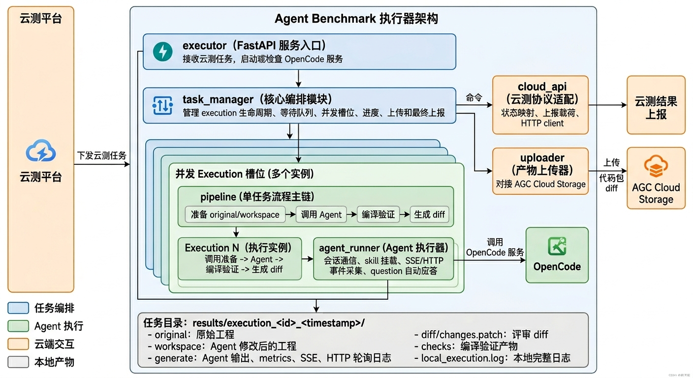
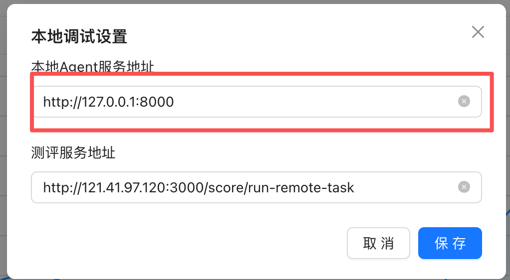

# 本地使用指南

本文只说明本地怎么把执行器跑起来，以及怎么确认它能接任务。

代码执行器总体架构图：


## 1. 前置条件
在管理台配置本地agent地址：


本地需要准备：

- Python 3.10+
- Python 包依赖
- Git
- `opencode` 命令
- 可用的 OpenCode 配置文件
- HarmonyOS / DevEco 命令行工具链

检查：

```bash
python --version
git --version
opencode --version
```

如果本机只有 `python3`，后续命令里的 `python` 换成 `python3`。

安装 Python 包：

```bash
python -m pip install fastapi uvicorn "pydantic>=2" PyYAML
```

这些包来自代码里的直接依赖：

- `fastapi`：Executor HTTP 服务。
- `uvicorn`：启动 FastAPI。
- `pydantic>=2`：云测接口模型使用 `field_validator`。
- `PyYAML`：读取 `config/config.yaml` 和 `config/agents.yaml`。

HarmonyOS / DevEco 工具链需要能提供下面 4 个路径：

- `node`
- `hvigorw.js`
- `harmonyos_sdk`
- `java_home`

这些路径在 `config/config.yaml` 的 `harmony_toolchain` 中配置。配置无效时，如果 `auto_detect=true`，程序会尝试自动探测；仍失败则拒绝启动。

如果使用会直接调用命令行工具的 Agent，还需要确认相关命令在当前环境可用，例如：

```bash
ohpm --version
hvigorw --version
```

如果缺少 `opencode`，先按 OpenCode 官方方式安装。

## 2. 配置

主要配置文件：

```text
config/config.yaml
config/agents.yaml
```

重点确认 `config/config.yaml`：

```yaml
task_manager:
  max_concurrency: 3
  cloud_base_url: "http://<云测平台地址>:3000"

opencode:
  opencode_server_url: "http://127.0.0.1:4096"
  opencode_config_path:
    macos: "~/.opencode/opencode.json"
    linux: "/root/.config/opencode/opencode.json"
    windows: "%APPDATA%\\opencode\\opencode.json"
```

说明：

- `cloud_base_url` 是执行器上报进度和结果的云测平台地址。
- `max_concurrency` 是本地并发任务数。
- `opencode_config_path` 是本机 OpenCode 配置来源。
- 执行器会把 OpenCode 配置复制到隔离目录 `.opencode_runtime/` 后再启动 OpenCode，避免污染用户全局配置。

`config/agents.yaml` 里配置可用 agent、模型、skill 和额外 prompt。常用 agent id 以实际文件为准。

## 3. 启动

macOS / Linux：

```bash
./deploy.sh start

关闭
./deploy.sh stop
```

Windows：

```bat
deploy.bat start

关闭
deploy.bat stop
```

脚本会启动 Executor。OpenCode Server 由执行器自动检查和拉起，默认端口：

- Executor：`8000`
- OpenCode：`4096`

常用命令：

```bash
./deploy.sh status
./deploy.sh logs
./deploy.sh stop
./deploy.sh restart-executor
```

Windows 使用对应的 `deploy.bat` 命令。

## 4. 验证服务

检查 Executor：

```bash
curl -s http://127.0.0.1:8000/api/health
```

检查 OpenCode：

```bash
curl -s http://127.0.0.1:4096/global/health
```

两个接口都正常返回，说明本地服务已启动。


## 5. 查看日志

进程级日志：

```bash
tail -f logs/agent_bench.log
```

单任务日志：

```bash
tail -f results/execution_<id>_<timestamp>/local_execution.log
```

常看文件：

```text
results/execution_<id>_<timestamp>/
├── workspace/                 # Agent 修改后的工程
├── diff/changes.patch          # 最终 diff
├── checks/pre_compile_check/   # 预编译日志
├── checks/post_compile_check/  # 修改后编译日志
├── generate/                   # Agent 输出、metrics、SSE、HTTP 轮询
├── cloud_api_events.json       # 最近一次云端请求/响应
└── local_execution.log         # 单任务完整日志
```

## 6. 常见问题

### OpenCode 服务不可用

先看：

```bash
./deploy.sh status
tail -f logs/agent_bench.log
```

确认：

- `opencode` 命令存在
- `config/config.yaml` 的 `opencode_config_path` 指向真实配置文件
- 4096 端口没有被其他进程占用

### Agent 没有实际修改

看：

```text
diff/changes.patch
generate/*_output.txt
local_execution.log
```

如果 `changes.patch` 为空，说明 workspace 没有有效代码变更，或者变更被 ignore 过滤。

### 编译失败

优先看后置编译日志：

```text
checks/post_compile_check/compile.log.txt
```

如果是任务开始前失败，再看：

```text
checks/pre_compile_check/compile.log.txt
```

### 云端没有看到完整进度

本地完整日志不会原样上传云端。云端 `executionLog` 只上传筛选后的阶段摘要，并做截断、节流和同秒同类去重。

本地排查以 `local_execution.log` 为准。
